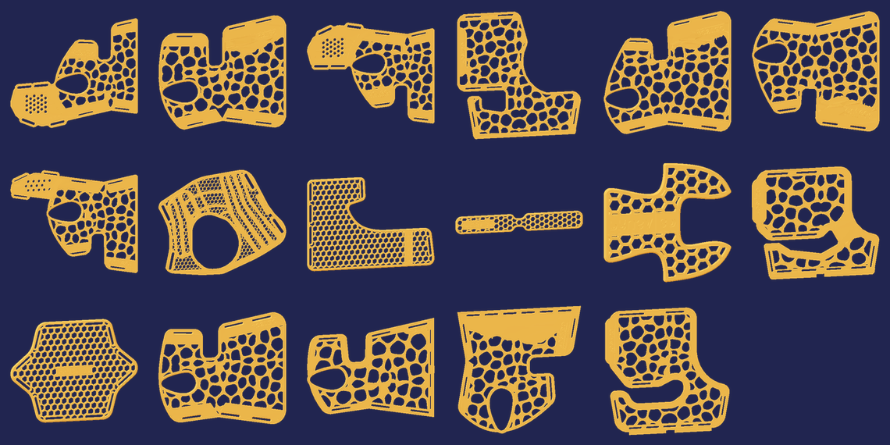

# Makers por Colombia — Registro de Donación Médica

App móvil para que la comunidad maker colombiana registre la producción y entrega de **férulas médicas impresas en 3D**.

Publicada en <https://makers4venezuela.github.io/Makers-por-Colombia/>

Un voluntario abre la app en el celular, se identifica una vez, elige el modelo en un catálogo visual, toma la foto de la pieza y registra cuántas fabricó y cuántas entregó. Los datos van a una hoja de Google Sheets y las fotos a Google Drive; los totales de toda la red se consolidan solos.

**El voluntario no configura nada:** abre el link y ya está conectado.



## Cómo está hecho

Un solo archivo: `index.html`. Sin build, sin dependencias, sin CDN, sin framework. Se sirve como archivo estático desde GitHub Pages.

| | |
|---|---|
| Front | HTML + CSS + JavaScript ES5, ~178 KB |
| Almacenamiento local | `localStorage` — la app funciona sin conexión |
| Backend | Google Apps Script sobre una hoja de cálculo |
| Fotos | Google Drive, subidas por el propio Apps Script |
| Escritura | `POST` en modo `no-cors`, en lotes de 3 registros |
| Lectura | `doGet` con JSONP (Apps Script no envía cabeceras CORS) |

## Funciones

- **Identificación del voluntario** — país, nombre, taller, ciudad y correo obligatorios, con autorización de tratamiento de datos (Ley 1581 de 2012)
- **Catálogo visual** — 17 modelos con miniatura, agrupados por categoría y con buscador
- **Catálogo de la comunidad** — los modelos que un taller registra a mano aparecen para todos con su propia foto, con deduplicación por nombre normalizado
- **Registro por lotes con destino** — «20 unidades para Armenia», con sugerencias de destinos ya usados
- **Foto solo para modelos nuevos** — se comprime a 640 px en el teléfono y sube a Drive
- **Panel de totales** — KPIs y ranking por destino, por modelo y por taller, con filtros por periodo y país
- **Resumen en la nube** — el Apps Script construye una pestaña `Resumen` con fórmulas que se actualiza sola
- **Funciona sin señal** — todo queda local y se sincroniza al reconectar
- **Export CSV** — separador `;` y BOM, para que Excel en español lo abra en columnas

## Estructura

```
index.html                        la app completa
Codigo-AppsScript.gs              el backend, para pegar en Apps Script
.nojekyll                         para GitHub Pages
docs/DESPLIEGUE.md                guía de puesta en marcha
docs/GITHUB.md                    publicación con GitHub Desktop y Pages
docs/catalogo-miniaturas.png      las 17 miniaturas del catálogo
docs/Makers-por-Colombia-datos.xlsx   respaldo del esquema de datos
```

## Poner en marcha

1. En la hoja de Google: **Extensiones → Apps Script**, pega el código (está en la app, ⚙️ → *Copiar código*) y ejecuta la función `setup`
2. **Implementar → Aplicación web** · Ejecutar como *Yo* · Acceso *Cualquier persona*. Copia la URL `/exec`
3. Pégala en `index.html`, en la constante `SHEET_URL`
4. Publica el repo con GitHub Desktop y activa **Settings → Pages → main / (root)**

`setup` crea solo la pestaña `Registro` con sus 16 columnas, la pestaña `Resumen` con las fórmulas y la carpeta de Drive para las fotos.

Los pasos con detalle están en [`docs/DESPLIEGUE.md`](docs/DESPLIEGUE.md).

## Identidad

La app usa la marca **KAFETIN**, tomada de los archivos originales del manual de identidad:

| | |
|---|---|
| `#0f0f23` | Azul profundo — fondo |
| `#fbba00` | Ámbar — acento principal |
| `#8db580` | Verde salvia — acento secundario |
| `#6b6263` | Gris — neutros |

El logo y el isotipo van incrustados como SVG vectorial (3 KB), no como imagen. La textura de curvas de nivel del manual se redujo a 400 px y se le quitó el fondo blanco, para que las líneas floten sobre el azul; pesa 46 KB y se muestra al 26 % de opacidad.

En la pantalla de entrada conviven el logo de KAFETIN y la bandera de Colombia, separados por una línea en verde salvia. La bandera lleva sus colores oficiales (`#fcd116`, `#003893`, `#ce1126`), no los de la marca.

## Sobre las miniaturas

No son fotos ni capturas de pantalla. Se renderizaron desde la malla real de cada `.stl` dentro de los proyectos `.3mf` de Bambu Studio: proyección ortográfica por la cara plana de cada pieza, iluminación Lambert y z-buffer. Van embebidas en el HTML como WebP sin pérdida de 200×200 px (109 KB en total) para que el catálogo también funcione sin conexión.

## Datos personales

La app recoge nombre, correo, ciudad, taller y —opcionalmente— teléfono del voluntario. **No recoge datos de pacientes**: las fotos son de las piezas fabricadas, no de personas.

Las fotos se almacenan en Google Drive con enlace de solo lectura. El endpoint que alimenta el panel público **no expone correo ni teléfono**.

> El repositorio es público. El `.gitignore` bloquea los CSV que exporta la app, porque llevan datos personales de voluntarios reales.

> Antes de publicar, edita la política dentro de `index.html` (busca `id="m-pol"`) y pon el responsable real y un correo de contacto para peticiones de habeas data.

## Modelos de férulas

Los `.stl` no están en este repositorio. Vienen de proyectos de terceros con sus propias licencias — entre ellos un conjunto de fijaciones de origen checo (`FIXACE …`). Este repositorio contiene únicamente el código de la app y las miniaturas derivadas de esas mallas.
